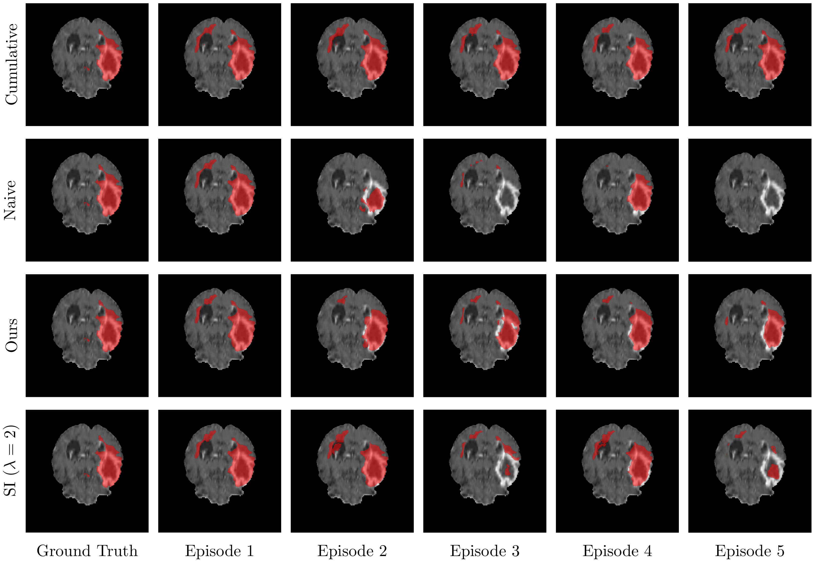
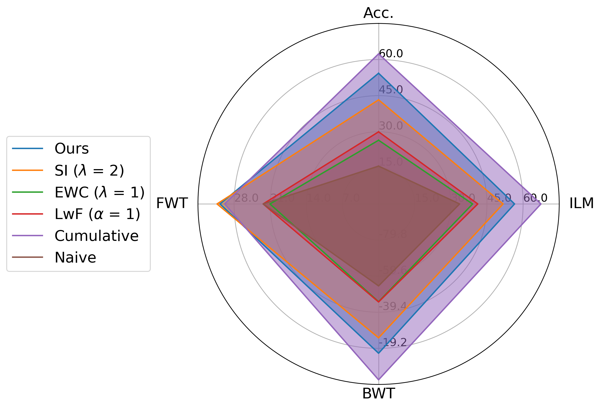
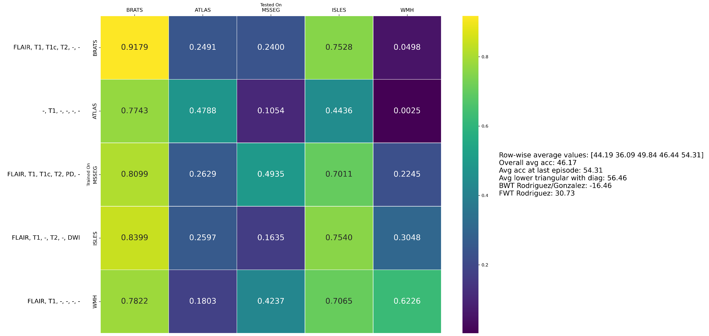

# Modality-independent Brain Lesion Segmentation with Privacy-aware Continual Learning 

This is the official repository of the paper titled "Modality-independent Brain Lesion Segmentation with Privacy-Aware Continual Learning," which introduces a privacy-aware continual learning approach for brain lesion segmentation with variable modality inputs.

> Yousef Sadegheih, Pratibha Kumari, and Dorit Merhof

## Abstract

> Traditional brain lesion segmentation models for multi-modal MRI are typically tailored to specific pathologies, relying on datasets with predefined modalities. Adapting to new MRI modalities or pathologies often requires training separate models, which contrasts with how medical professionals incrementally expand their expertise by learning from diverse datasets over time. Inspired by this human learning process, we propose a unified segmentation model capable of sequentially learning from multiple datasets with varying modalities and pathologies. Our approach leverages a privacy-aware continual learning framework that integrates a mixture-of-experts mechanism and dual knowledge distillation to mitigate catastrophic forgetting while not compromising performance on newly encountered datasets. Extensive experiments across five diverse brain MRI datasets and two dataset sequences demonstrate the effectiveness of our framework in maintaining a single adaptable model, capable of handling varying hospital protocols, imaging modalities, and disease types. Compared to widely used privacy-aware continual learning methods such as LwF, SI, and EWC, our method achieves an average Dice score improvement of approximately 16%. Our framework represents a significant step toward more versatile and practical brain lesion segmentation models.

## Key Contributions

- **First study in this domain**: To the best of our knowledge, this is the first study exploring continual learning (CL) for brain MRI segmentation under domain shifts, including heterogeneous modalities, pathologies, and acquisition centers.
- **Novel privacy-aware framework**: We propose a domain-conditioned mixture-of-experts (MoE) in UNet, integrating modality and pathology information for 3D segmentation.
- **Superiority over other buffer-free CL methods**: Our dual-distillation and MoE-based CL strategy significantly outperforms existing buffer-free CL approaches.
## Method

We apply random modality dropping for the model's input to enhance generalization. To prevent catastrophic forgetting, we employ a Mixture-of-Experts (MoE) framework combined with dual distillation. Below is an overview of our method.

<p align="center">
  
</p>

*For a detailed explanation of each component, please refer to our paper.*

## Datasets

Our experiments were conducted on the following datasets:

- [BRATS ( 2016+2017 decathlon )](http://medicaldecathlon.com/)
- [ATLAS 2.0](https://fcon_1000.projects.nitrc.org/indi/retro/atlas.html)
- [WMH_2017](https://wmh.isi.uu.nl/#_Data)
- [MSSEG_2016](https://www.nature.com/articles/s41598-018-31911-7)
- [ISLES_2015](https://www.isles-challenge.org/ISLES2015/)

For preprocessing, we followed the [MultiNet repository](https://github.com/WenTXuL/MultiUnet). You can use the scripts inside the `preprocess_pipeline` folder to adapt the dataset for training and inference. For convenience, the preprocessed data can be downloaded from [here]().

<p align="center">
  
</p>

<p align="center">
  
</p>

## Getting Started

This section provides instructions for running our privacy-aware continual learning framework for brain lesion segmentation.

### Requirements
  - CUDA 12.x
  - Python v3.7 or higher
  - Pytorch v2.x
  - Hardware Spec
    - GPU with 8GB memory or larger capacity
    - _For our experiments, we used 1GPU(A40-48G)_

Install the required packages:

```bash
pip install -r requirements.txt
```
### Training and inference

To run our framework, execute the script in the `src` folder.
```bash
cd src
./run.sh
```
Inference runs automatically after each episode.
**Before running the script above please adjust the paths variable inside it.**

### Pre-trained weights
You can download the pre-trained weights for different sequences below:

Sequence 1 weights         | Sequence 2 weights
---------------------------|---------------------------
[Download](https://myfiles.uni-regensburg.de/filr/public-link/file-download/0447879c94911a8801949498544b6686/129810/5127083706323043509/Yousef_MOE_num_exp_4_beta_0.8_alpha_Dynamic_alpha_max_0.6_temp_2_optim_adam_lr_0.001_bs_4_epochs_400_drop_1%28S1%29.zip) | [Download](https://myfiles.uni-regensburg.de/filr/public-link/file-download/0447879c94911a880194949a6298668e/129811/6005144147454142615/Yousef_MOE_num_exp_4_beta_0.8_alpha_Dynamic_alpha_max_0.6_temp_2_optim_adam_lr_0.001_bs_4_epochs_400_drop_1%28S2%29.zip)                       

### Results visualization

Once training and inference are complete, you can use `plot_results.py` to generate a heatmap of the results and corresponding metrics. This will help visualize the model’s performance.

<p align="center">
  
</p>

**The results are reported using the Dice score.**

## Acknowledgments

This repository is based on [MultiUnet](https://github.com/WenTXuL/MultiUnet). We thank the authors for their valuable contributions.

## Citation

If you find this work useful for your research, please cite:

```bibtex
@article{sadegheih2025brainCL,
  title={Modality-independent Brain Lesion Segmentation with Privacy-aware Continual Learning},
  author={Sadegheih, Yousef and Kumari, Pratibha and Merhof, Dorit},
}